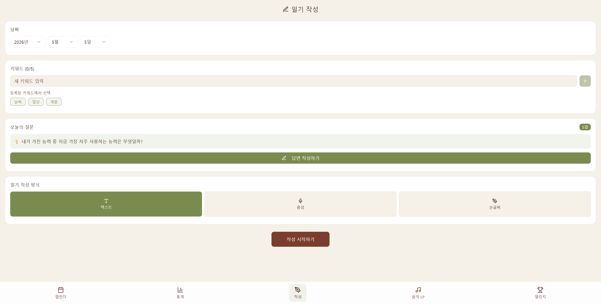
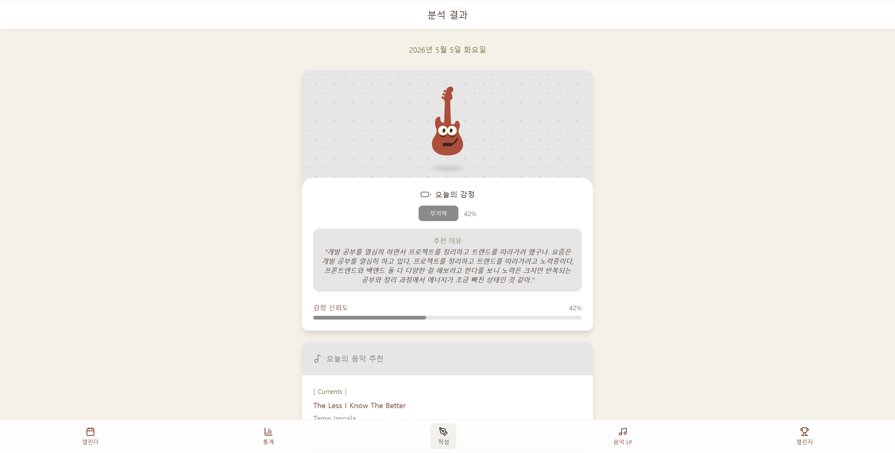
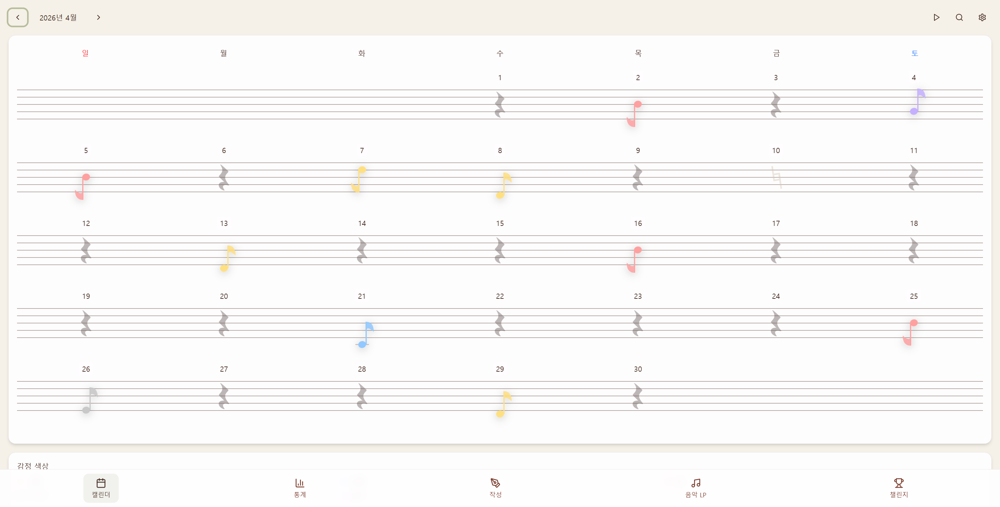
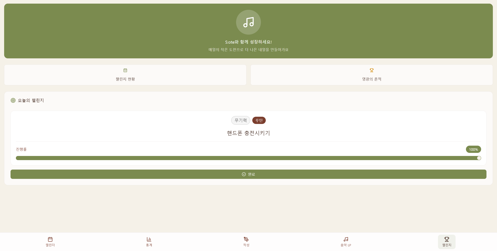
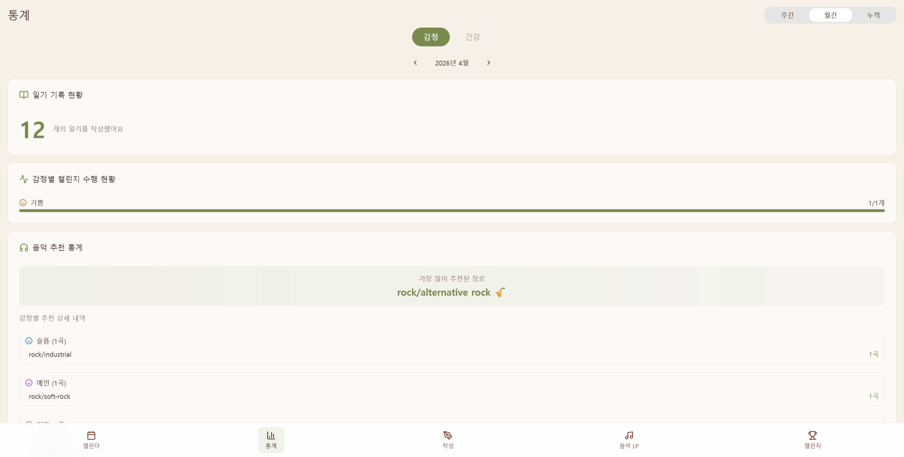
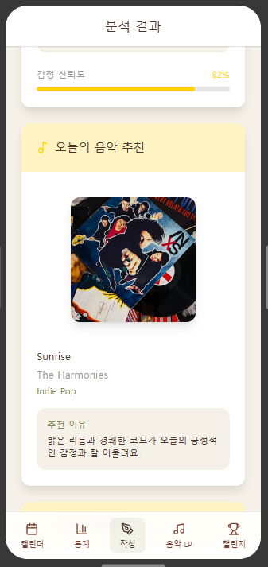

# S:ote Frontend

> AI 기반 감정 분석을 활용한 개인 맞춤형 음악·챌린지 추천 일기 시스템     
> **S:ote**의 프론트엔드 리포지토리입니다.


---

## Project Overview

**S:ote**는 사용자가 작성한 일기를 기반으로 감정을 분석하고,     
감정에 맞는 음악과 챌린지를 추천하는 감정 기반 일기 서비스입니다.

사용자는 텍스트, 음성, 손글씨 기반으로 일기를 작성할 수 있으며,      
작성된 일기는 AI 감정 분석을 통해 오늘의 감정, 감정 요약, 추천 음악, 감정 회복 챌린지로 이어집니다.

또한 감정 캘린더, 감정 통계, LP 보관함, 감정 악보 재생 기능을 통해 자신의 감정 기록과 챌린지 수행 결과를 다시 확인할 수 있습니다.

본 저장소는 Fluxion 팀 캡스톤 프로젝트 **S:ote**의 프론트엔드 코드를 개인 포트폴리오용으로 정리한 리포지토리입니다.

| Item            | Description                              |
| --------------- | ---------------------------------------- |
| Project         | S:ote                                    |
| Team            | Fluxion                                  |
| Period          | 2025 Capstone Design                     |
| Award           | 2025 캡스톤 경진대회 아리상                        |
| Main Role       | Frontend / Backend / AI                  |
| Repository Type | Portfolio-maintained frontend repository |

---

## Service Concept

일기 서비스는 사용자의 감정을 기록할 수는 있지만, 기록 이후의 행동까지 연결하는 경우는 많지 않습니다.

S:ote는 단순히 일기를 저장하는 데 그치지 않고,      
감정 분석 결과를 기반으로 사용자가 자신의 감정을 돌아보고 회복 행동까지 이어갈 수 있도록 설계했습니다.

핵심 서비스 흐름은 다음과 같습니다.

```text
일기 작성
  → AI 감정 분석
  → 감정 요약 확인
  → 감정 기반 음악 추천
  → 감정 회복 챌린지 수행
  → LP 보상 저장
  → 캘린더 / 통계 / 감정 악보로 회고
```

프론트엔드에서는 이 흐름이 하나의 사용자 경험으로 자연스럽게 이어지도록 화면 구조, 상태 처리, 예외 상황, 시각화 방식을 설계했습니다.

특히 감정 기록을 단순 텍스트나 차트로만 보여주지 않고,      
**악보와 LP**라는 감성적인 시각 요소로 표현하여 사용자가 자신의 감정 변화를 더 직관적으로 돌아볼 수 있도록 구현했습니다.

---

## Branch Guide

| Branch                                                                                   | Description                               |
| ---------------------------------------------------------------------------------------- | ----------------------------------------- |
| [`main`](https://github.com/DevLucia-21/sote-fe/tree/main)                               | 포트폴리오용 최종 정리 브랜치                          |
| [`refactor/local`](https://github.com/DevLucia-21/sote-fe/tree/refactor/local)           | 프로젝트 종료 후 기능 재점검 및 로컬 실행 안정화를 위한 리팩토링 브랜치 |
| [`demo/exhibition`](https://github.com/DevLucia-21/sote-fe/tree/demo/exhibition)         | 캡스톤 경진대회 전시 및 시연용 브랜치                     |
| [`release/deploy-main`](https://github.com/DevLucia-21/sote-fe/tree/release/deploy-main) | 기존 배포용 `main` 상태 보존 브랜치                   |

---

## Service Preview

S:ote는 일기 작성부터 감정 분석, 음악·챌린지 추천, 감정 회고까지 이어지는 흐름을 하나의 웹앱 경험으로 구성했습니다.

| Diary Writing | Emotion Analysis |
| --- | --- |
| 사용자가 텍스트, 음성, 손글씨 기반으로 일기를 작성하는 화면입니다. | AI 감정 분석 결과와 추천 음악, 추천 챌린지를 확인하는 화면입니다. |
|  |  |

| Emotion Calendar & Music Sheet | Challenge |
| --- | --- |
| 월별 감정 기록을 캘린더와 악보 형태로 시각화한 화면입니다. | 감정 분석 결과를 바탕으로 추천된 챌린지를 확인하고 수행하는 화면입니다. |
|  |  |

| Statistics | Mobile Responsive View |
| --- | --- |
| 감정 분포, 키워드, 챌린지 수행 기록을 확인하는 통계 화면입니다. | 모바일 환경에서 감정 분석 결과 화면이 반응형으로 표시되는 예시입니다. |
|  |  |

---

## Core Features

### 1. Authentication

사용자 로그인, 회원가입, 토큰 기반 인증 흐름을 구현했습니다.

Access Token 만료 시 Refresh Token을 사용해 인증 상태를 갱신하고,      
인증 실패 시 사용자 세션을 정리하도록 구성했습니다.

관련 파일:

```text
src/components/AuthScreen.tsx
src/services/api.ts
src/utils/auth.ts
```

---

### 2. Diary

사용자가 텍스트, 음성, 손글씨 기반으로 일기를 작성할 수 있도록 화면 흐름을 구성했습니다.

일기 작성 후에는 감정 분석으로 이어지며, 작성된 일기와 분석 결과를 상세 화면에서 확인할 수 있도록 구성했습니다.

리팩토링 과정에서는 일기 작성, 수정, 재작성 흐름을 정리하고,      
재작성된 일기에 분석 결과가 없는 경우에도 화면이 깨지지 않도록 예외 처리를 보완했습니다.

관련 파일:

```text
src/components/DiaryEntry.tsx
src/components/diary/
```

---

### 3. Daily Question

일기 작성을 돕기 위해 하루 질문 기능을 구성했습니다.

사용자는 매월 같은 날짜에 반복되는 질문을 통해 자신의 생각과 감정 변화를 비교할 수 있으며,       
질문을 기반으로 일기 작성을 시작할 수 있습니다.

관련 파일:

```text
src/components/questions/
```

---

### 4. AI Emotion Analysis

일기 작성 후 AI 감정 분석 결과를 조회하고, 분석 결과가 준비되지 않았거나 실패한 경우에도 사용자 흐름이 끊기지 않도록 처리했습니다.

분석 결과 화면에서는 감정 요약, 추천 음악, 추천 챌린지를 카드 형태로 보여줍니다.

관련 파일:

```text
src/components/analysis/
```

---

### 5. Music Recommendation

감정 분석 결과에 따라 추천 음악 정보를 화면에 표시하고, 앨범 이미지와 아티스트 정보를 함께 제공했습니다.

초기 구현에서는 Spotify 연동을 통해 추천 음악의 앨범 커버와 외부 재생 링크 이동을 제공했습니다.        
현재 공개 리포지토리 기준에서는 Spotify 개발자 계정 권한 정책 변경으로 일부 음악 링크 기능이 제한될 수 있습니다.

관련 파일:

```text
src/components/analysis/
src/components/lp/
src/components/MusicLP.tsx
```

---

### 6. Challenge

감정 분석 결과에 따라 추천된 챌린지를 확인하고, 사용자가 챌린지를 완료할 수 있도록 구현했습니다.

챌린지를 완료하면 LP 보상으로 이어지며, 사용자는 자신의 챌린지 수행 기록을 다시 확인할 수 있습니다.

리팩토링 과정에서는 추천 챌린지 조회, 오늘의 챌린지 상태 확인, 완료 처리 흐름을 보완했습니다.

관련 파일:

```text
src/components/ChallengeView.tsx
src/components/challenge/
```

---

### 7. Music LP

감정 기반으로 추천된 음악과 챌린지 완료 보상을 LP 형태로 시각화했습니다.

사용자는 오늘의 LP 보상과 주간 LP 기록을 확인할 수 있으며, 감정 경험을 음악 기록처럼 다시 돌아볼 수 있습니다.

관련 파일:

```text
src/components/LPRewardView.tsx
src/components/MusicLP.tsx
src/components/lp/
```

---

### 8. Emotion Calendar & Music Sheet

감정 분석 결과를 캘린더에 시각적으로 표시하여, 사용자가 자신의 감정 흐름을 날짜별로 확인할 수 있도록 구성했습니다.

월별 감정 기록은 악보 형태로 표현되며, 각 음표는 다음 기준에 따라 다르게 표시됩니다.

| Data  | Music Sheet Expression |
| ----- | ---------------------- |
| 일기 길이 | 음 길이                   |
| 감정 점수 | 음 높낮이                  |
| 감정 라벨 | 음표 색상                  |

이를 통해 사용자가 감정 기록을 단순한 텍스트나 차트가 아니라 하나의 멜로디처럼 확인할 수 있도록 구성했습니다.

또한 악보 재생 기능을 통해 월별 감정 흐름을 시각적 기록에서 청각적 경험으로 확장했습니다.

관련 파일:

```text
src/components/CalendarView.tsx
src/components/calendar/
```

---

### 9. Statistics

감정 분석, 일기 작성, 챌린지 수행 데이터를 기반으로 사용자의 감정 기록을 통계 화면에서 확인할 수 있도록 구현했습니다.

감정 분포, 일기 작성 기록, 챌린지 수행률 등을 통해 사용자가 자신의 감정 패턴을 다시 확인할 수 있도록 구성했습니다.

관련 파일:

```text
src/components/StatisticsView.tsx
src/components/statistics/
```

---

### 10. Settings & Notification

사용자 설정 화면과 Firebase Cloud Messaging 기반 알림 설정 흐름을 구성했습니다.

일기 작성 알림, 챌린지 수행 알림, 감정 분석 완료 알림 등 사용자 행동을 돕는 알림 기능을 고려했습니다.

또한 라이트 모드와 다크 모드 전환을 통해 사용자가 원하는 화면 테마를 선택할 수 있도록 구성했습니다.

관련 파일:

```text
src/components/SettingsView.tsx
src/components/settings/
src/firebase-config.ts
public/firebase-messaging-sw.js
```

---

### 11. Easy Mode

서비스 접근성을 높이기 위해 단순화된 화면 흐름을 제공하는 Easy Mode 화면을 구성했습니다.

일반 모드보다 핵심 기능에 더 쉽게 접근할 수 있도록 화면 흐름을 분리하고,        
일기 작성과 감정 확인 과정의 복잡도를 줄이는 방향으로 구성했습니다.

관련 파일:

```text
src/components/EasyModeApp.tsx
src/components/easy-mode/
```

---

## User Flow

```text
회원가입 / 로그인
        ↓
일기 작성
        ↓
AI 감정 분석 요청
        ↓
감정 분석 결과 확인
        ↓
음악 추천 + 챌린지 추천
        ↓
챌린지 완료
        ↓
LP 보상 저장
        ↓
캘린더 / 통계 / LP 보관함에서 기록 확인
        ↓
감정 악보로 월별 감정 흐름 확인
```

---

## My Contribution

본 프로젝트에서는 초기에는 백엔드와 AI 서버 개발을 함께 담당했으며, 프로젝트 진행 과정에서 프론트엔드 개발까지 맡아 전체 서비스 흐름을 구현했습니다.

프론트엔드에서는 초기 UI 화면 구성과 사용자 흐름 설계를 주도했고, 이후 일부 API 연동 작업은 다른 팀원이 진행했습니다.       
전시 이전까지는 주요 화면의 기능 연동과 수정 작업을 진행했으며,       
프로젝트 종료 이후에는 다시 서비스를 실행하며 발견된 오류를 수정하고 프론트엔드 구조와 기능 흐름을 재정리했습니다.

최종적으로 프로젝트의 초기 화면 설계와 종료 후 리팩토링, 공개 포트폴리오용 리포지토리 정리까지 담당했습니다.

| Area              | Contribution                                           |
| ----------------- | ------------------------------------------------------ |
| Frontend UI       | 일기, 분석 결과, 챌린지, LP 보관함, 캘린더, 통계, 설정 화면 구성              |
| User Flow         | 일기 작성부터 감정 분석, 음악 추천, 챌린지 수행, LP 보상까지 이어지는 전체 화면 흐름 설계 |
| Emotion Sheet     | 일기 길이, 감정 점수, 감정 라벨 기반 음표 길이, 높낮이, 색상 표현 및 악보 재생 흐름 구성 |
| Theme             | 라이트 모드와 다크 모드 화면 구성                                    |
| Daily Question    | 매월 같은 질문을 통해 감정 변화를 확인할 수 있는 하루 질문 화면 구성               |
| Music UX          | 추천 음악 앨범 이미지 표시 및 Spotify 외부 링크 이동 흐름 구성               |
| Analysis UX       | 감정 분석 로딩, 결과 표시, 분석 실패 및 미완료 상태 예외 처리                  |
| Challenge UX      | 챌린지 추천, 상태 조회, 완료 처리 화면 흐름 구성                          |
| Easy Mode         | 쉬운 모드 화면 흐름과 일반 모드와의 분기 구조 구성                          |
| Notification      | Firebase Cloud Messaging 기반 알림 설정 흐름 구성                |
| Refactoring       | 프로젝트 종료 후 로컬 실행 오류 수정 및 기능 흐름 안정화                      |
| Portfolio Cleanup | 공개 리포지토리 전환을 위한 환경 변수, README, 브랜치 정리                  |

---

## Tech Stack

| Category              | Stack                    |
| --------------------- | ------------------------ |
| Frontend              | React, TypeScript, Vite  |
| Styling               | CSS, Tailwind-style utility classes |
| UI Library            | Radix UI, lucide-react   |
| API Client            | Axios                    |
| State Management      | React Hooks              |
| Chart / Visualization | Recharts                 |
| Notification          | Firebase Cloud Messaging |
| Animation             | motion                   |
| Date                  | date-fns                 |
| Build Tool            | Vite                     |

---

## Frontend Architecture

S:ote 프론트엔드는 화면 단위 컴포넌트를 도메인별로 분리하여 관리했습니다.

감정 분석, 캘린더, 챌린지, LP, 통계, 설정, Easy Mode처럼 기능별 화면 수가 많았기 때문에,       
각 화면 흐름을 독립적으로 관리하면서도 전체 서비스 흐름이 끊기지 않도록 구성했습니다.

특히 일기 작성 이후 감정 분석, 음악 추천, 챌린지 추천, LP 보상, 감정 캘린더와 통계로 이어지는 흐름이 서로 연결되어 있어,      
단순 화면 구현보다 상태와 예외 상황을 함께 고려하는 방식으로 설계했습니다.

---

## Project Structure

```text
src/
├── components/
│   ├── analysis/        # 감정 분석 결과 화면
│   ├── calendar/        # 감정 캘린더 및 감정 악보 관련 컴포넌트
│   ├── challenge/       # 챌린지 관련 컴포넌트
│   ├── common/          # 공통 컴포넌트
│   ├── diary/           # 일기 작성 및 상세 관련 컴포넌트
│   ├── easy-mode/       # 쉬운 모드 화면
│   ├── lp/              # LP 보상 및 보관함 관련 컴포넌트
│   ├── questions/       # 하루 질문 관련 컴포넌트
│   ├── settings/        # 사용자 설정 및 알림 설정
│   ├── statistics/      # 감정 통계 화면
│   └── ui/              # 공통 UI 컴포넌트
│
├── services/
│   └── api.ts           # Axios 인스턴스 및 API 요청 설정
│
├── types/
│   └── api.ts           # API 타입 정의
│
├── utils/
│   └── auth.ts          # 인증 토큰 저장 및 관리
│
├── firebase-config.ts   # Firebase 클라이언트 설정
├── App.tsx              # 앱 진입 흐름
└── main.tsx             # React 엔트리 포인트
```

---

## External Integration

프론트엔드는 Spring Boot 백엔드, FastAPI AI 서버, Firebase Cloud Messaging, Spotify와 연동하여     
감정 분석 결과, 챌린지 상태, LP 보상, 알림 설정, 추천 음악 정보를 화면에 반영했습니다.

| Integration              | Description                           |
| ------------------------ | ------------------------------------- |
| Spring Boot Backend      | 사용자, 일기, 분석 결과, 챌린지, LP 보상, 통계 데이터 연동 |
| FastAPI AI Server        | STT, OCR, 감정 분석, 음악 추천 흐름 연동          |
| Firebase Cloud Messaging | 일기 작성, 챌린지 수행, 감정 분석 완료 알림            |
| Spotify                  | 추천 음악 앨범 이미지 및 외부 재생 링크 연동            |

Spotify 연동을 통해 추천 음악의 앨범 이미지와 외부 재생 링크를 제공했으나,       
이후 Spotify 개발자 계정 권한 정책 변경으로 현재 공개 실행 환경에서는 음악 재생 연결이 제한될 수 있습니다.

---

## Technical Challenges

### 1. 유기적으로 연결된 서비스 흐름 설계

S:ote는 일기 작성, 감정 분석, 음악 추천, 챌린지 추천, 챌린지 완료, LP 보상, 캘린더, 통계가 각각 독립된 화면이 아니라       
하나의 사용자 흐름으로 연결되는 서비스였습니다.

따라서 단순히 개별 화면을 구현하는 것보다, 한 기능의 상태 변화가 다른 화면에 자연스럽게 반영되도록 구성하는 것이 중요했습니다.

특히 감정 분석 결과 유무, 챌린지 완료 여부, LP 보상 상태, 재작성된 일기의 분석 결과 부재 등       
다양한 분기 상황을 고려해 화면이 깨지지 않도록 예외 처리를 보완했습니다.

---

### 2. 감정 데이터를 악보로 변환하는 시각화 설계

S:ote의 캘린더는 단순히 감정 라벨을 날짜별로 보여주는 방식이 아니라, 한 달의 감정 흐름을 악보처럼 표현하는 구조로 설계했습니다.

일기 길이는 음 길이, 감정 점수는 음 높낮이, 감정 라벨은 음표 색상으로 매핑하여 감정 데이터를 시각적으로 구분했습니다.

이 과정에서 사용자가 감정 흐름을 직관적으로 이해할 수 있도록 데이터 값과 UI 표현 방식 사이의 기준을 설계하는 데 집중했습니다.

또한 악보 재생 기능을 통해 감정 기록을 시각적 기록에서 청각적 경험으로 확장했습니다.

---

### 3. 감정 분석 결과 예외 처리

감정 분석은 일기 저장 이후 비동기적으로 처리되기 때문에, 분석 결과가 즉시 준비되지 않는 상황이 발생할 수 있었습니다.

이를 해결하기 위해 분석 결과가 없거나 준비 중인 경우에도 일기 화면이 정상적으로 유지되도록 처리했습니다.

---

### 4. 챌린지 추천 상태 동기화

챌린지 추천 결과와 오늘의 챌린지 상태가 다르게 표시되는 문제가 발생할 수 있어, 추천 조회와 상태 조회 흐름을 분리해 정리했습니다.

이를 통해 사용자가 실제로 완료 가능한 챌린지를 화면에서 확인할 수 있도록 개선했습니다.

---

### 5. Easy Mode 화면 분기 구성

Easy Mode는 일반 모드와 동일한 데이터를 사용하면서도 더 단순한 화면 흐름을 제공해야 했기 때문에,      
기존 화면 구조와 분기 처리가 복잡해질 수 있었습니다.

이를 해결하기 위해 Easy Mode 관련 화면을 별도 컴포넌트 영역으로 분리하고,      
사용자가 필요한 핵심 기능에 더 쉽게 접근할 수 있도록 화면 흐름을 정리했습니다.

---

### 6. FCM 설정값 공개 리포지토리 정리

Firebase Cloud Messaging을 사용하면서 서비스 워커 파일에 Firebase 설정값이 직접 들어가는 문제가 있었습니다.

포트폴리오 공개 리포지토리 전환 과정에서 실제 설정값을 제거하고, `.env.example`과 예시 설정을 기준으로 프로젝트 구조를 정리했습니다.

---

### 7. 프로젝트 종료 후 로컬 실행 안정화

프로젝트 종료 이후 다시 실행했을 때 일부 기능이 정상적으로 작동하지 않는 문제가 있어,     
`refactor/local` 브랜치에서 프론트엔드 흐름과 API 연동 코드를 재점검했습니다.

이후 최종 수정 내용을 `main` 브랜치에 반영하여 포트폴리오용 코드로 정리했습니다.

---

## Environment Variables

프로젝트 실행을 위해 루트 경로에 `.env` 파일을 생성하고, `.env.example`을 참고해 필요한 환경 변수를 설정합니다.

```env
VITE_API_BASE_URL=
VITE_AI_BASE_URL=

VITE_FIREBASE_API_KEY=
VITE_FIREBASE_AUTH_DOMAIN=
VITE_FIREBASE_PROJECT_ID=
VITE_FIREBASE_STORAGE_BUCKET=
VITE_FIREBASE_MESSAGING_SENDER_ID=
VITE_FIREBASE_APP_ID=
VITE_FIREBASE_VAPID_KEY=
```

`public/firebase-messaging-sw.js`는 브라우저의 Service Worker로 동작하기 때문에 Vite의 `import.meta.env`를 직접 사용할 수 없습니다.

따라서 공개 리포지토리에서는 실제 Firebase 프로젝트 값을 제거하고 예시값으로 대체했습니다.     
실제 배포 환경에서는 해당 파일의 Firebase 설정값을 배포 환경에 맞게 교체해야 합니다.

---

## Running the Project

```bash
git clone https://github.com/DevLucia-21/sote-fe.git
cd sote-fe
npm install
```
.env.example 파일을 복사해 .env 파일을 생성한 뒤, 필요한 환경 변수를 입력합니다.
```bash
npm run dev
```

`.env` 파일에는 백엔드 API URL, AI 서버 URL, Firebase 설정값을 입력해야 합니다.

빌드 명령어는 다음과 같습니다.

```bash
npm run build
```

---

## Related Repositories

| Repository | Description              |
| ---------- | ------------------------ |
| [`sote-fe`](https://github.com/DevLucia-21/sote-fe)  | S:ote 프론트엔드 리포지토리        |
| [`sote-be`](https://github.com/DevLucia-21/sote-be)  | Spring Boot 기반 백엔드 리포지토리 |
| [`sote-ai`](https://github.com/DevLucia-21/sote-ai)  | FastAPI 기반 AI 서버 리포지토리   |

본 저장소는 Fluxion 팀 프로젝트의 프론트엔드 코드를 개인 포트폴리오용으로 정리한 리포지토리입니다.

---

## Author

**Yeeun Park**

* GitHub: [DevLucia-21](https://github.com/DevLucia-21)
